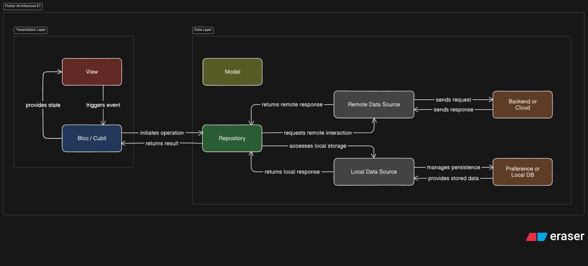

# Flutter Architecture (E1) Documentation

This document outlines a clean Flutter architecture, separating concerns into **Presentation** and **Data Layers** to enhance modularity, testability, and maintainability through clear responsibilities and interactions. For this architecture (E1), **Feature-based grouping** is implemented within the Presentation Layer.



## 1. Architecture Overview

The diagram details a unidirectional data and event flow, featuring:

- **Presentation Layer:** Manages UI display and user input, organized by **specific features/screens**.

- **Data Layer:** Handles data retrieval and management (local, remote).

- **Model:** Defines application data structures.

## 2. Components and Responsibilities

### 2.1. Presentation Layer

The Presentation Layer is organized into distinct **Features** or **Screens**, where each feature/screen encapsulates its specific UI logic and state management.

- **View (Red Box)**

  - **Responsibility:** Displays UI, renders based on states, and captures user input. It passively reacts to state changes.

  - **Interactions:**
    - **`triggers event` (to Bloc / Cubit):** Dispatches events from user interactions (e.g., taps, text input) for handling.
    - **`provides state` (from Bloc / Cubit):** Observes and rebuilds UI based on new states emitted.

- **Bloc / Cubit (Blue Box)**

  - **Responsibility:** Manages application state, processes events, applies business logic, and emits states to update UI, acting as a View-Data Layer intermediary.

  - **Interactions:**
    - **`initiates operation` (to Repository):** Calls `Repository` for data operations (e.g., fetch, save, delete) based on View events.
    * **`returns result` (from Repository):** Receives operation outcomes (data/status).
    * **`provides state` (to View):** Emits new states to `View` after event processing and result handling, updating UI.
    * **`triggers event` (from View):** Receives user action events.

### 2.2. Data Layer

The Data Layer manages all data operations, abstracting data sources from business logic.

- **Model (Olive Green Box)**

  - **Responsibility:** Defines application data structures (e.g., `User`, `Product`). Acts as a pure data container.

  - **Interactions:** Passed between layers (e.g., `Repository` to `Bloc / Cubit`).

- **Repository (Dark Green Box)**

  - **Responsibility:** Central data source, abstracting data source complexity (remote API, local DB, preferences) from `Bloc / Cubit`. Decides between local cache or remote server data fetching.

  - **Interactions:**
    - **`requests remote interaction` (to Remote Data Source):** Delegates remote data requests/operations.
    * **`returns remote response` (from Remote Data Source):** Receives remote data/status responses.
    * **`accesses local storage` (to Local Data Source):** Delegates local data requests/operations or data persistence.
    * **`returns local response` (from Local Data Source):** Receives local data/status responses.
    * **`initiates operation` (from Bloc / Cubit):** Receives data operation requests.
    * **`returns result` (to Bloc / Cubit):** Provides consolidated operation results.

- **Remote Data Source (Dark Grey Box)**

  - **Responsibility:** Manages direct remote service (API) communication, handling network requests, response parsing, and errors.

  - **Interactions:**
    - **`sends request` (to Backend or Cloud):** Sends network requests.
    - **`sends response` (from Backend or Cloud):** Receives network responses.
    - **`requests remote interaction` (from Repository):** Receives remote data/operation requests.
    - **`returns remote response` (to Repository):** Provides processed remote service responses.

- **Local Data Source (Grey Box)**

  - **Responsibility:** Manages direct communication with local storage (Preference or Local DB) for read/write operations.

  - **Interactions:**
    - **`manages persistence` (to Preference or Local DB):** Performs CRUD operations on local persistent storage.
    - **`provides stored data` (from Preference or Local DB):** Retrieves and returns stored data.
    * **`accesses local storage` (from Repository):** Receives local data/operation requests.
    * **`returns local response` (to Repository):** Provides processed local storage responses.

- **Backend or Cloud (Brown Box)**

  - **Responsibility:** External services (APIs, cloud) providing data or server-side logic.

  - **Interactions:**
    - **`sends response` (to Remote Data Source):** Responds to `Remote Data Source` requests.
    - **`sends request` (from Remote Data Source):** Receives `Remote Data Source` requests.

- **Preference or Local DB (Brown Box)**

  - **Responsibility:** Device's local persistent storage (shared preferences for simple data, local database for complex data).

  - **Interactions:**
    - **`provides stored data` (to Local Data Source):** Returns requested stored data.
    - **`manages persistence` (from Local Data Source):** Receives operations (CRUD) from `Local Data Source`.

## 3. Data Flow and Event Propagation

1.  **User Interaction:** **View** `triggers event` to **Bloc / Cubit**.

2.  **Event Handling:** **Bloc / Cubit** processes the event, applies business logic, then `initiates operation` to the **Repository**.

3.  **Data Source Selection:** **Repository** determines whether to `requests remote interaction` (via **Remote Data Source**) or `accesses local storage` (via **Local Data Source**) based on data needs or caching.

4.  **Remote Data Flow:** If remote data is required, **Remote Data Source** `sends request` to **Backend or Cloud**, which then `sends response` back. **Remote Data Source** `returns remote response` to **Repository**.

5.  **Local Data Flow:** If local data is needed/stored, **Local Data Source** `manages persistence` with **Preference or Local DB**. The storage `provides stored data` back, and **Local Data Source** `returns local response` to **Repository**.

6.  **Result Consolidation:** **Repository** receives responses (remote/local) and `returns result` to **Bloc / Cubit**.

7.  **State & UI Update:** **Bloc / Cubit** processes the result, `provides state` to **View**, which then updates the UI.

This pattern offers a robust, scalable foundation for Flutter apps, ensuring clear separation of concerns and predictable data flow.

## 4. Project Structure

The project structure which implements this **Feature-based architecture** will look like this:

```
lib/
├── common/
│   ├── blocs/
│   ├── utils/
│   │   ├── number_util.dart
│   │   └── snackbar_util.dart
│   └── widgets/             # Common reusable widgets are located here
│   ├── app_assets.dart
│   ├── app_colors.dart
│   ├── constants.dart
│   └── enums.dart
├── core/
│   ├── errors/
│   │   ├── exceptions.dart
│   │   └── failures.dart
│   ├── platforms/
│   │   └── network_info.dart
│   ├── app_router.dart
│   └── di.dart
├── data/
│   ├── models/
│   │   └── (e.g., user_model.dart)
│   ├── data_sources/
│   │   ├── local/
│   │   │   └── (e.g., session_data_source.dart)
│   │   └── remote/
│   │       ├── (e.g., auth_remote_data_source.dart)
│   │       └── (e.g., destination_remote_data_source.dart)
│   └── repositories/
│       ├── (e.g., auth_repository.dart)
│       └── (e.g., destination_repository.dart)
├── presentation/
│   ├── auth/                # Grouping all authentication-related features (Onboarding, Login, Register)
│   │   ├── blocs/           # Contains all Bloc(s) for the auth feature
│   │   │   ├── login_bloc/  # Folder for LoginBloc and its related files (event, state, bloc file)
│   │   │   └── register_bloc/ # Folder for RegisterBloc and its related files
│   │   └── views/           # Contains all pages and feature-specific widgets for the auth feature
│   │       ├── login_page.dart
│   │       ├── register_page.dart
│   │       ├── auth_input.dart    # Example of a widget reusable within the auth feature
│   │       └── auth_background.dart # Example of another widget reusable within the auth feature
│   │
│   ├── onboarding/          # Standalone Onboarding screen/feature
│   │   ├── blocs/
│   │   └── views/
│   │
│   ├── destination/          # Grouping all destination-related features
│   │   ├── destination_detail/
│   │   │   ├── blocs/
│   │   │   └── views/
│   │   └── review/
│   │       ├── blocs/
│   │       └── views/
│   │
│   ├── user/                # Grouping all user-related features (Account, Profile)
│   │   ├── account/
│   │   │   ├── blocs/
│   │   │   └── views/
│   │   └── profile/
│   │       ├── blocs/
│   │       └── views/
│   │
│   ├── home/                # Standalone Home screen that may aggregate data/widgets from multiple features
│   │   ├── blocs/           # Contains Bloc(s) specific to the Home screen's aggregated state
│   │   └── views/           # home_screen.dart, and potentially sections/widgets that combine other feature elements
│   │
│   └── settings/            # Standalone Settings screen that may contain various user preferences/configurations
│       ├── blocs/           # Contains Bloc(s) specific to the Settings screen's aggregated state
│       └── views/           # settings_screen.dart, and potentially sections/widgets for different settings categories
│
└── main.dart
```

|                             |                                 |                                |
| --------------------------- | ------------------------------- | ------------------------------ |
|  |  |  |
